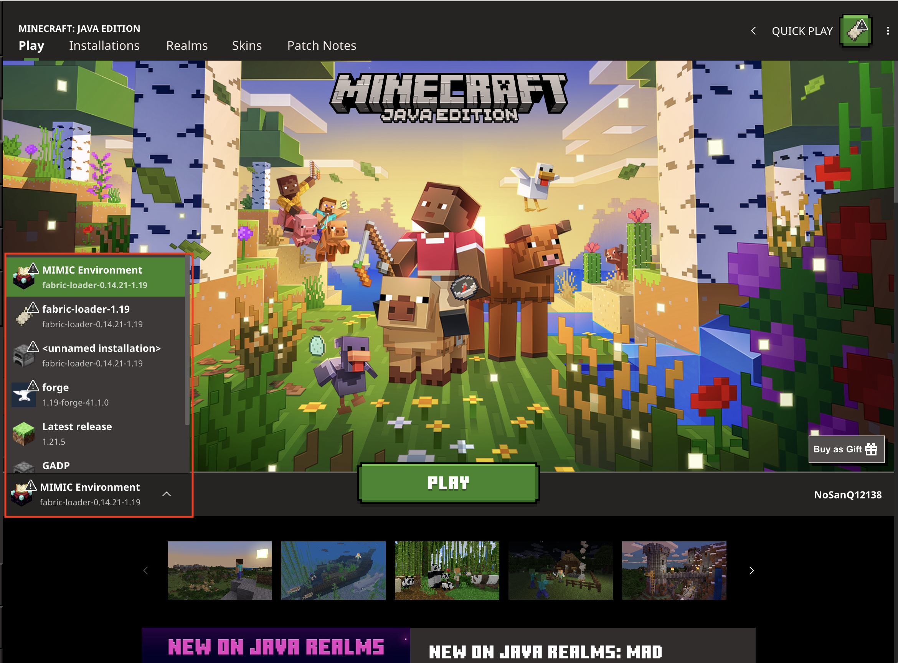
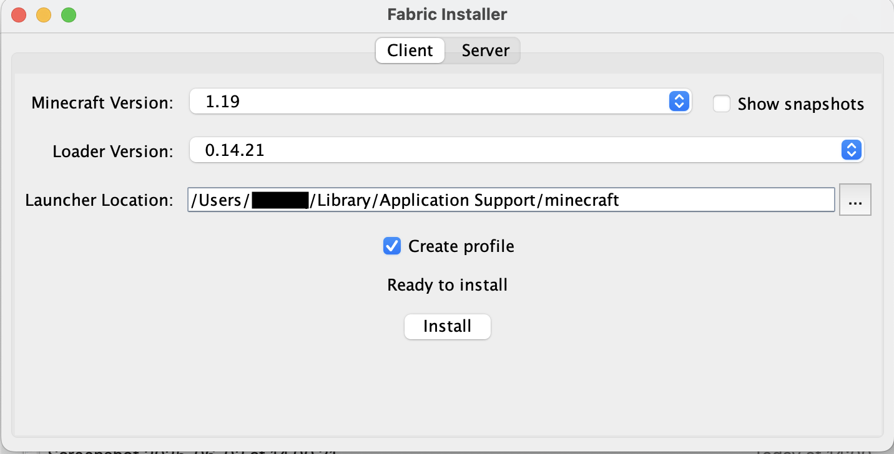
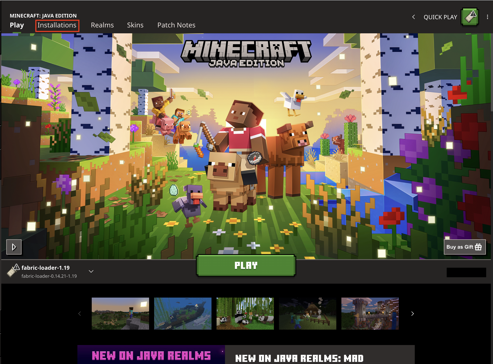
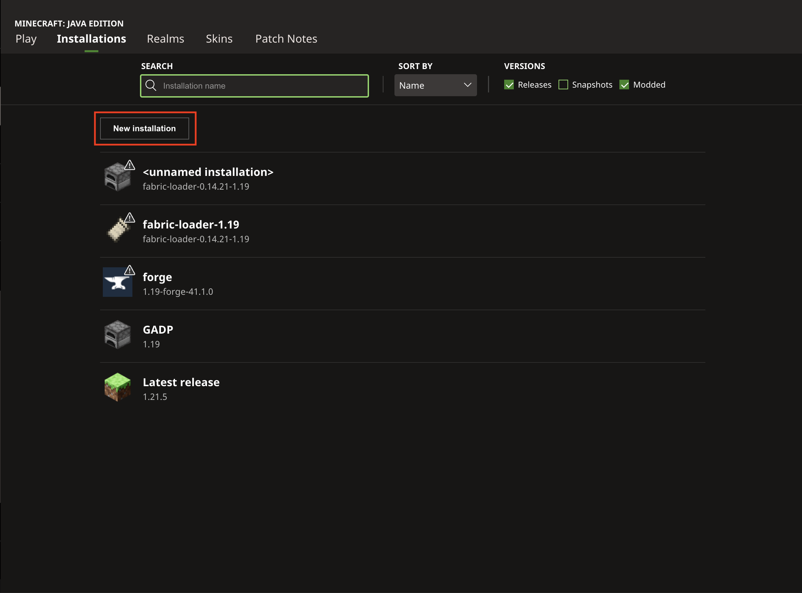
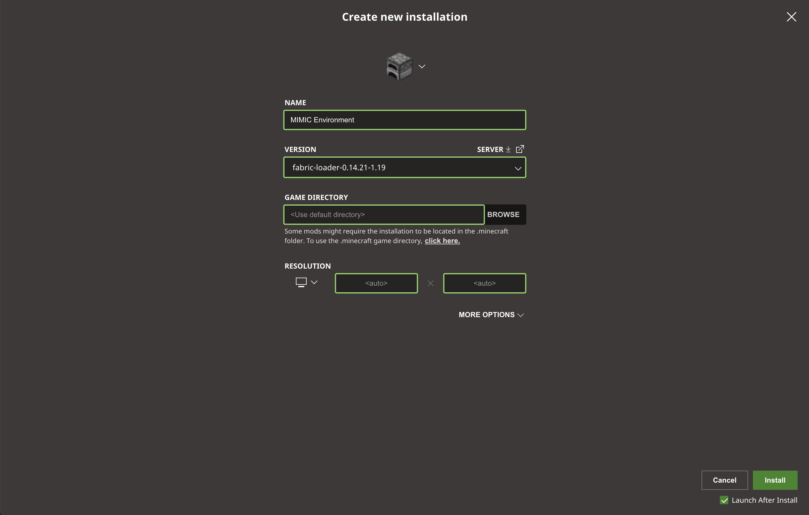
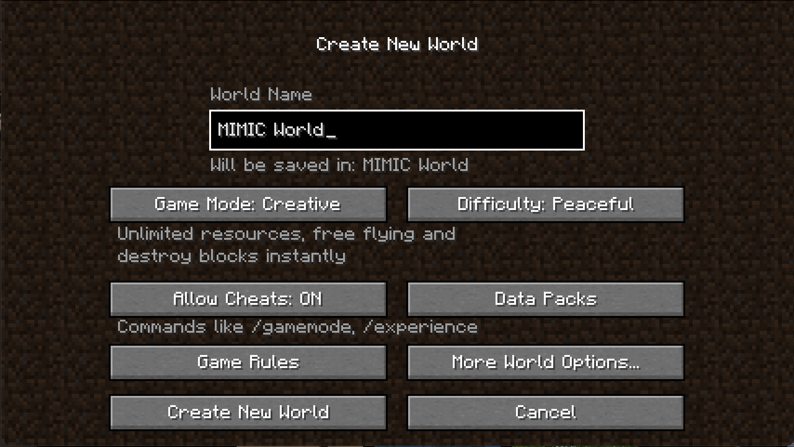
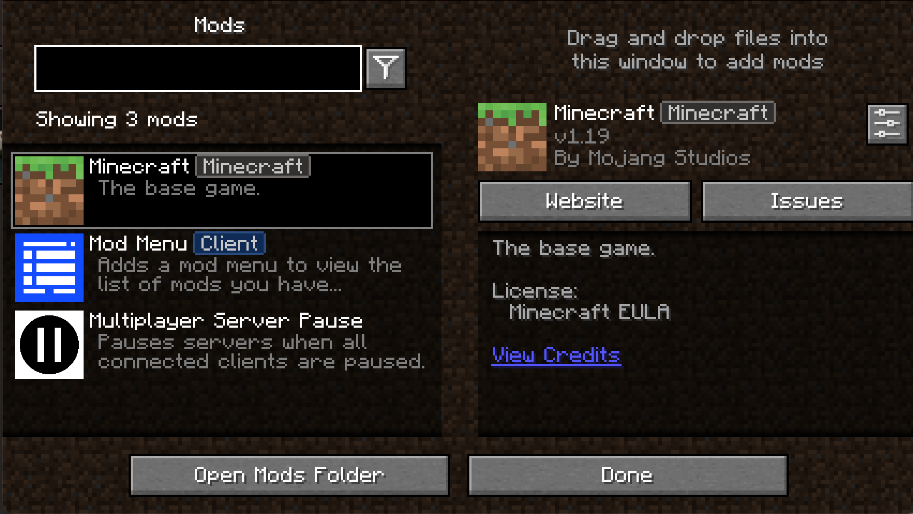
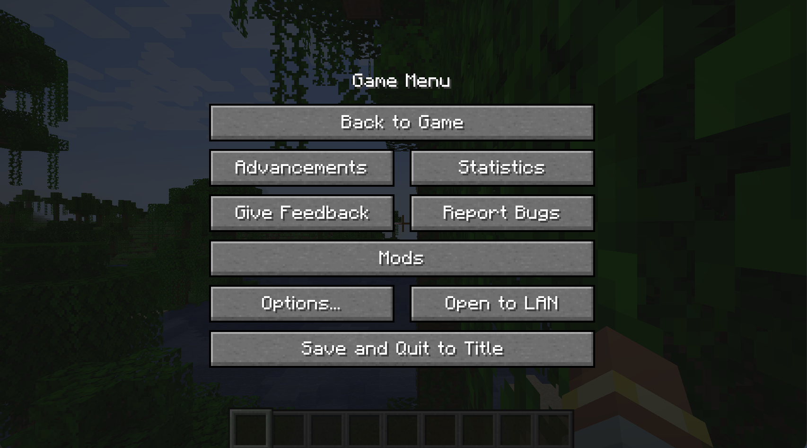
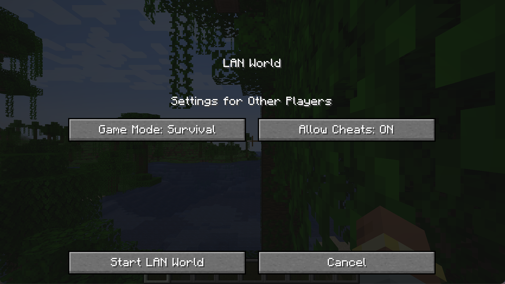
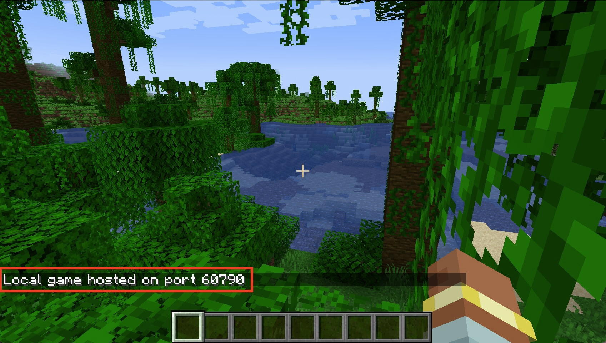

# Game Description

[Minecraft](https://www.minecraft.net/en-us) is a closed-source open-world sandbox game.
It is a widely adopted subject with rich agent baselines due to its popularity and the complexity of its environment for supporting all kinds of realistic agent behaviours.

Minecraft complies through Platforms and is available on Windows, macOS, Linux, Android, and IOS.

Since this game is a closed-source game, we can only run MIMIC-Py through a third-party API library, [Mineflayer](https://prismarinejs.github.io/mineflayer/#/), that can generate a bot inside the game and interact with the game world.

# How to Run MIMIC-Py

## Prerequisites
- This game supports running on Windows, macOS, Linux, Android, and IOS. But the MIMIC-Py agent is only tested on Windows and macOS.
- This game has many editions, but MIMIC-Py is only tested on the Java Edition of Minecraft.

## IMPORTANT
- Make sure your working directory is set to the `MIMIC-Python` directory, as all commands and configurations will be based on this path.
- Sadly, to run MIMIC-Py on Minecraft, you **have to buy your own Minecraft account** and install the game on your computer. MIMIC-Py is not able to run on the free version of Minecraft.
- As mentioned in the paper, [ODYSSEY](https://doi.org/10.48550/arXiv.2407.15325) is taken as the state-of-the-art agent baseline. And all the experiments were conducted based on this [version](https://github.com/zju-vipa/Odyssey/tree/19f8c06feb4d431e91ff2f2db89c74ac6a67108f) of ODYSSEY.
- **Before starting the configuration in this section**, please **make sure** you have completed the general setup of MIMIC-Py as described in the [main README file](../README.md) and set `GAME_SUBJECT` in `.env` file to `MC`.

## Virtual Machine [Recommended for Demonstration Only]
1. If you are using a VM for running MIMIC-Py, please make sure the VM has access to the internet and can run Minecraft Java Edition smoothly.
   - Information about general setup for VM is provided in the [main README file](../README.md#virtual-machine-recommended-for-demonstration-only).

2. Unfortunately, Minecraft is a paid game, so you will need to buy your own Minecraft account to run MIMIC-Py on Minecraft. And to make it activated, you will need to log in to the Microsoft account for the Windows in VM for the first time.

3. After logged in to the Windows OS in the VM, search inside the VM Windows for Minecraft Launcher.

4. Open the Minecraft Launcher, select the `Minecraft: JAVA Edition` and select the `MIMIC Environment`, and click on the `Play` button.
   

5. Then you can jump to Section [Start the Server](#start-the-server) to set up the Minecraft server and run MIMIC-Py.

## Install Node.js and Dependencies
1. Make sure you have [Node.js (LTS only)](https://nodejs.org/) installed on your machine.
   - **Important:** Please install a **Node.js LTS version (e.g., 18.x or 20.x)**
   - Newer Node versions (e.g., 21+, 25) are **not supported** due to incompatibilities with `mineflayer` (e.g., deprecated `SlowBuffer`), which may cause the Mineflayer subprocess to fail at runtime.

2. We recommend using a version manager such as `nvm`:
   ```bash
   nvm install --lts
   nvm use --lts
   ```

3. Open a new terminal and navigate to the `./MIMIC_Minecraft` directory.
    ```bash
    cd ./MIMIC_Minecraft
    ```

4. Install the required dependencies by running the following command:
    ```bash
    npm install chromadb@1.10.5
    npm install
    ```

5. Navigate to the `./MIMIC_Minecraft/mc_env/mineflayer/mineflayer-collectblock` directory and install the dependencies for the modified version of from [Wang et al.](https://github.com/MineDojo/Voyager) `mineflayer-collectblock` plugin:
   ```bash
   cd ./mineflayer-collectblock
   npm install
   ```

6. Navigate to the `./MIMIC_Minecraft/mc_env/mineflayer` directory and install the dependencies for a modified version of [Mineflayer](https://github.com/PrismarineJS/mineflayer) (a third-party API library to interact with Minecraft):
   ```bash
   cd ./mc_env/mineflayer
   npm install
   ```
   
7. If compatibility issues arise, remove all `node_modules` directories in the paths above and reinstall dependencies:
   ```bash
   rm -rf node_modules
   npm install
   ```

8. Note that if you revived `MODULE_NOT_FOUND` error for `mineflayer-collectblock`, please try to reinstall the `mineflayer` package after making sure the `mineflayer-collectblock` is correctly built from step 5.

## Install the Game
Download and install Minecraft from the [official website](https://www.minecraft.net/en-us/download).

## Minecraft Server Deployment

### Download Server of the Required Version

1. Download the installer for the server [here](https://fabricmc.net/use/installer/) by clicking on the button `Download installer (Universal/.JAR)`. 
2. Open it and select the `Client` tab.
3. Select the `Minecraft Version` to 1.19, and `Loader Version` to 0.14.21. These versions are tested and working with MIMIC-Py.
4. Make sure the Launcher Location points to the minecraft folder (should be set by default).
   - If not set, it should be something like: `/Users/your_username/Library/Application Support/minecraft` on macOS or `C:\Users\your_username\AppData\Roaming\.minecraft` on Windows. (May be hidden)

   

5. Click on the `Install` button to install the Fabric Loader. Make sure none of the Minecraft launchers or games is running when you are installing the Fabric Loader.

### Install Required Mods to Support MIMIC-Py

1. To support seamless interaction between MIMIC-Py and Minecraft, the following mods are required and none of them modifies the game mechanics or adds any new features to the game. They are only used to support the interaction between MIMIC-Py and Minecraft.

2. All the mods of tested versions are also provided in the folder `./MIMIC_Minecraft/mods`. But feel free to download them from here:

   1. [Fabric API](https://modrinth.com/mod/fabric-api/version/0.58.0+1.19): Basic Fabric APIs.

   2. [Mod Menu](https://cdn.modrinth.com/data/mOgUt4GM/versions/4.0.4/modmenu-4.0.4.jar): Used to manage all the mods that you download.

   3. [Complete Config](https://www.curseforge.com/minecraft/mc-mods/completeconfig/download/3821056): Dependency of server pause.

   4. [Multi Server Pause](https://www.curseforge.com/minecraft/mc-mods/multiplayer-server-pause-fabric/download/3822586): Used to pause the server when waiting for GPT-4 to reply.

3. Put them at `/Users/your_username/Library/Application Support/minecraft/mods` on macOS or `C:\Users\your_username\AppData\Roaming\.minecraft\mods` on Windows. (May be hidden)
   - If there is no `mods` folder, you can create one there.

### Launch the Minecraft Client
1. Open the Minecraft Launcher, select the `Minecraft: JAVA Edition` and click on the `Installations` tab.
   

2. Click on the `New Installation` button to create a new installation.

   

3. Configure the installation as follows, and then click on the `Install` button:
   - Name: MIMIC Environment
   - Version: fabric-loader-0.14.21-1.19

   

4. After the installation is complete, it would automatically start the Game in this version. 
If no, please go back to the Play tab, and select the `MIMIC Environment` installation you just created, and click on the `Play` button.

   

### Use a predefined World [Recommended for Demonstration]
1. **NOTE:** There is a pre-created world provided in the folder [./MIMIC_Minecraft/MIMIC World](MIMIC World), you can directly use it to skip the following steps of creating a new world and installing the data pack. 
   - Just copy the `MIMIC World` folder to the `.minecraft/saves/` folder of your Minecraft directory, which is located at `/Users/your_username/Library/Application Support/minecraft/saves` on macOS or `C:\Users\your_username\AppData\Roaming\.minecraft\saves` on Windows. (May be hidden)
   - Then jump to the [Start the Server](#start-the-server) Section.

### Create a New World [Recommended for Development]
1. While in the game, click on the `Singleplayer` button, and then click on the `Create New World` button.

2. Configure the world as follows, and then click on the `Create New World` button:
   - Name: MIMIC World
   - Game Mode: Creative
   - Difficulty: Peaceful
   - Allow Cheats: ON
   
   

4. Then quit the game, we need to install a data pack for this world to share the inventory between the player and the bot so that MIMIC-Py can access the items it has in the inventory.

### Install the Data Pack to Support MIMIC-Py
1. The data pack of tested version is also provided in the folder `./MIMIC_Minecraft/mods/shared-inventory-v2-dist`. But feel free to download it from here:
   1. [Minecraft Shared Inventory](https://www.planetminecraft.com/data-pack/shared-inventory/): Used to share the inventory between the player and the bot.

2. Put the downloaded data pack in the `datapacks` folder of your Minecraft world. 
   - You can find the `datapacks` folder by navigating to the `.minecraft/saves/Your-World-Name/datapacks` directory.
   - If there is no `datapacks` folder, you can create one there.
   - For more instructions on how to install a data pack, please visit: [_How to Install a Data Pack_](https://www.planetminecraft.com/blog/how-to-download-and-install-minecraft-data-packs/).

### Start the Server
1. Restart the game, click on the `Singleplayer` button, and then open the world you created.

3. Once in the game, check if you have all the mods we need by pressing on the key `Escape` and click on the `Mods` button. You should see the following mods listed:

   

2. Then, get back to the game and press the key `Escape` again, and click on the `Open to LAN` button to open a local server for MIMIC-Py.

   

3. Configure the LAN server as follows, and then click on the `Start LAN World` button:
   - Game Mode: Survival
   - Allow Cheats: ON

    

4. Once the LAN server is started, you should see a message in the chat window indicating that the server is running, along with the port number. For example:

   

5. Take this port number as the `MC_PORT` in the `.env` file at root directory, which is used to connect MIMIC-Py to the Minecraft server later.
The detailed instruction to set the `.env` file will be introduced [later](./README.md#configure-the-settings).


## Configure the Settings
1. Taking `.emv.keep.this` file located in the `root` directory as an example to create the `.env` file located in the same place.
Find it [here](../.env.keep.this).

2. Set the `MC_PORT` to the port number of the Minecraft server you started earlier in this [section at 7](./README.md#start-the-server).

3. Set the `MC_TASK` to the task you want MIMIC-Py to perform. You can choose from the following options:
   - combat_1_cave_spider
   - combat_1_skeleton
   - combat_1_spider
   - cook_1_meat
   - harvest_1_diamond
   - harvest_1_sugar
   - sheer_1_sheep
   - survive_for_1_day
   - **Note:** Tasks outside this list do not have predefined task descriptions. Users may still specify arbitrary task names, but such tasks will not be associated with structured task descriptions for the Planner.

4. Set the `MC_MONSTER_TYPE` to the one you want to fight against which is aligned to the task you set. You can choose from the following options:
   - cave_spider
   - skeleton
   - spider
   - **Note:** This parameter is required only when a combat-related task is selected. The specified monster type will be spawned automatically after one in-game day (approximately 20 minutes) for the agent to engage. Other monster types supported by Minecraft may also be used.

## Run MIMIC-Py in Minecraft
1. Once you configured all the settings in the `.env` file, you can start MIMIC-Py by running the `run.py` file [here](../run.py), 
or by running the following command in the terminal while in the `./MIMIC_Minecraft` directory:
    ```bash
    python ../run.py
    ```

2. After running it, you should see the output similar to the follows in the console:

   ```
   [INFO] File written successfully: ./out/MC//your/model_name/your_task_name_and_id/out_yyyy-mm-dd_hh-mm-ss_example.log

   yyyy-mm-dd hh-mm-ss reset node server
   yyyy-mm-dd hh-mm-ss ===============reset unpause mc server starts.===============
   yyyy-mm-dd hh-mm-ss ==========reset unpause mc server ends. Cost 0.XXX seconds==========
   yyyy-mm-dd hh-mm-ss ===============reset stop mc_server starts.===============
   yyyy-mm-dd hh-mm-ss ==========reset stop mc_server ends. Cost 0.XXX seconds==========
   yyyy-mm-dd hh-mm-ss ===============reset check_process starts.===============
   yyyy-mm-dd hh-mm-ss Start Mineflayer process
   yyyy-mm-dd hh-mm-ss ===============check process run mineflayer starts.===============

   wait ready_event to set
   Subprocess mineflayer started with PID XXX.
   yyyy-mm-dd hh-mm-ss ==========check process run mineflayer ends. Cost 0.XXX seconds==========
   yyyy-mm-dd hh-mm-ss mineflayer ready line: Server started on port 3000

   yyyy-mm-dd hh-mm-ss start response:[["observe",{"voxels":["the","blocks","around"],"status":{"health":20,"food":20,"saturation":5,"position":{"x":X,"y":Y,"z":Z},"velocity":{"x":X,"y":Y,"z":Z},"yaw":X.XX,"pitch":X.XX,"onGround":true,"equipment":[null,null,null,null,null,null],"name":"example","isInWater":false,"isInLava":false,"isCollidedHorizontally":false,"isCollidedVertically":true,"biome":"","entities":{"entities":XX,"around":3XX},"timeOfDay":"day","inventoryUsed":0,"elapsedTime":0},"inventory":{},"nearbyChests":{},"blockRecords":[]}]]
   yyyy-mm-dd hh-mm-ss ==========reset check_process ends. Cost X.XXX seconds==========
   
   Loading custom model: True
   Loading custom model: False
   INFO:Socket:✅ Connected to localhost:1111
   INFO:mineflayer:✅ Python bridge connected
   INFO:chromadb.telemetry.product.posthog:Anonymized telemetry enabled. See                     https://docs.trychroma.com/telemetry for more information.
   $$ MC:memory_system.MemorySystem:log: Memory System initialized with 0 memories.
   Loading custom model: False
   INFO:chromadb.telemetry.product.posthog:Anonymized telemetry enabled. See                     https://docs.trychroma.com/telemetry for more information.
   @@ MC:bot_components.BotComponent:log: Skill root directory: ./skill_system/skill_library/MC
   @@ MC:bot_components.BotComponent:log: Basic skill directory: ./skill_system/skill_library/MC/basic_skills
   @@ MC:bot_components.BotComponent:log: Advanced skill directory: ./skill_system/skill_library/MC/advanced_skills
   @@ MC:bot_components.BotComponent:log: Generated skill directory: ./skill_system/skill_library/MC/generated_skills/example
   @@ MC:bot_components.BotComponent:log: Initializing skill directories...
   @@ MC:bot_components.BotComponent:log: Found 9 basic skills in ./skill_system/skill_library/MC/basic_skills/description:
   {'killMob', 'useChest', 'craftItem', 'startCombating', 'mineflayer', 'mineBlock', 'smeltItem', 'placeItem', 'exploreUntil'}
   $$ MC:skill_system.SkillSystem:log: Skill System initialized with 0 skills.
   ```

   - You will also see the following output in the Minecraft chat window:

    

3. Press key `T` to open the in-game chat window, and type the command `b` to start MIMIC-Py.

## Important Notes Before Running MIMIC-Py in Minecraft
1. Ensure that all required mods and the data pack listed above are correctly installed and enabled in Minecraft before starting MIMIC-Py. Missing or disabled components may prevent proper interaction between the agent and the game.

2. While MIMIC-Py is running, do not manually pause the game (e.g., by pressing `Esc`) or move the game window to the background, as this may interrupt the agent’s execution.

3. To prevent the game from progressing while waiting for LLM responses, MIMIC-Py automatically pauses and resumes the game when no in-game actions are being executed.
   - This is commonly done by all the agents in the fields.
   - Minecraft does not provide an external API to query the pause state, so the pause mechanism is implemented by toggling an internal flag.
     - Before starting MIMIC-Py, make sure the game is actively running (i.e., the player can move). If the game is paused, press `T` and enter `/pause` to resume.
   
4. Due to game mechanics, the agent may not always spawn near the player. You can use Minecraft’s teleport command to reposition either the agent or yourself:
   - Teleport the agent to the player: `/tp {AGENT_NAME} {YOUR_USERNAME}` in the in-game chat window (press `T` to open).
   - Teleport the player to the agent: `/tp {YOUR_USERNAME} {AGENT_NAME}` in the in-game chat window.
