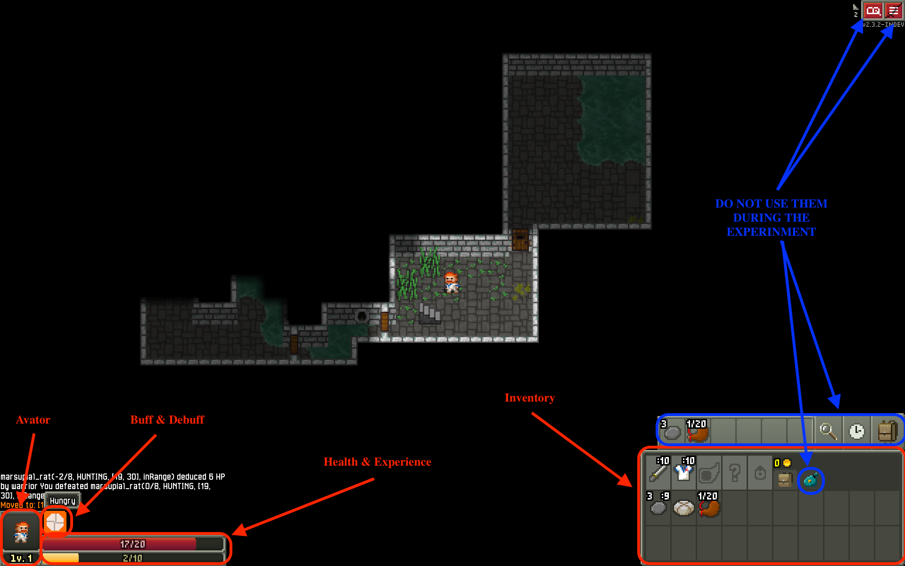

# Welcome to the Gaming Testing Experiment
## Introduction
Thank you for joining us in this experiment.
Our experiment is designed as a simulation of the testing process for a gaming application.
As a result, we generously ask you to act as a human tester for our game application.
We want to evaluate how a human tester can perform in testing our game application.
Your participation is invaluable in contributing to this research.

## Consent Form
Before we begin, it is essential for all participants to read and sign the consent form.
This form outlines the details of the study, including your rights and our commitment to your privacy and data protection.

## Demographic Survey
Please fill out this [demographic survey](https://forms.office.com/r/8XcfLLgwsC) to help us understand your background and experience with games.

## Game Information
This game is named as Shattered Pixel Dungeon.
Shattered Pixel Dungeon is a traditional roguelike dungeon crawler RPG that’s simple to get into.
It also means you will need to explore the dungeons, fight monsters, collect items.
In the game, you will also find some puzzles to be solved.
It is a turn-based game, so that means you can take your time to plan your next move before acting.
This game is an open-source game and was developed since 2013.

## Instructions
In this experiment, you will be asked to perform the following tasks:
1. Explore the dungeons as deep as you can in the game.
2. Act as a tester to trigger bugs in the game, this means that you should try as many different actions, explore as many places as possible to see if you can find any bugs.
3. This experiment will last for 4 hours. You do not have to continuously test the game for 4 hours, you can have a break and continue testing the game later, but the timer would be stopped accordingly.
4. During the game, if you lose or win the game, the game will be restarted automatically with a new map, and you cannot go back to the previous map.

Since this game has been modified to an experimental version, you have to follow the instructions below while playing the game:
1. You can only use the mouse to click on the map to move the character, or click on the items to choose your actions.
2. If you want to restart the game, press "F12."
3. You can only press the `space bar` when you want to wait for a turn or press and hold the `space bar` for sleeping to recover health.

## How to Play the Game
1. Click on the tiles shown in the game to move the character or interact with the objects.
2. Your health is shown in the bottom left corner of the screen, and it will increase gradually through turns. But it will only happen when you are not in a fight and are not in hunger mode.
3. Your hero will be hungry after a certain number of turns, and you will need to eat food to recover from hunger, otherwise, when it turns to starving mode, your health will decrease gradually.
4. Press the `space bar` to wait for a turn or press and hold the `space bar` to sleep and recover health until it increased by 1.
5. If you want to pick up an item, click on the item while you are standing on it.
6. If you want to use an item shown in the inventory, click on the item and then choose the action you want to take.
7. Your hero will get experience points after killing monsters, and you can level up when you have enough experience points. You can click on your avatar to see your experience points and level, and upgrade your hero after leveling up.

### Thank you once again for your participation and for contributing to this research project.