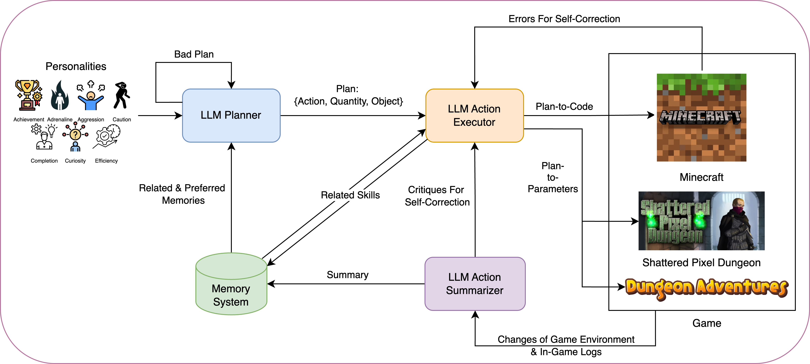
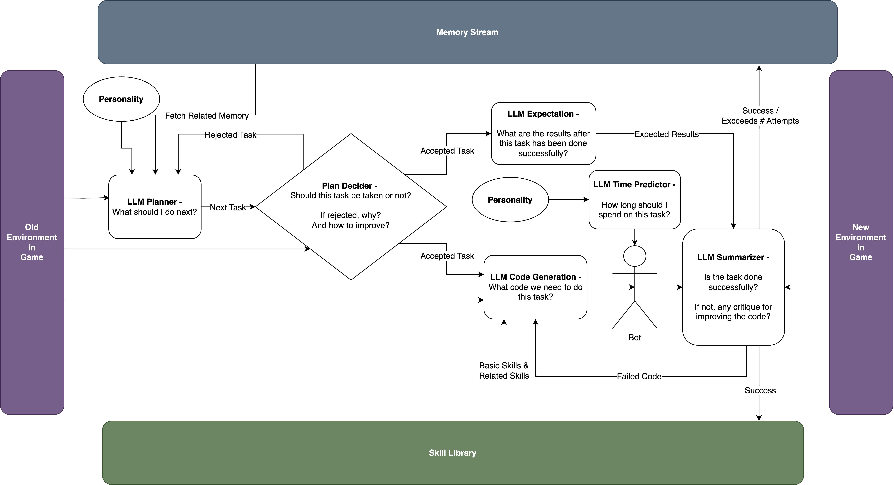
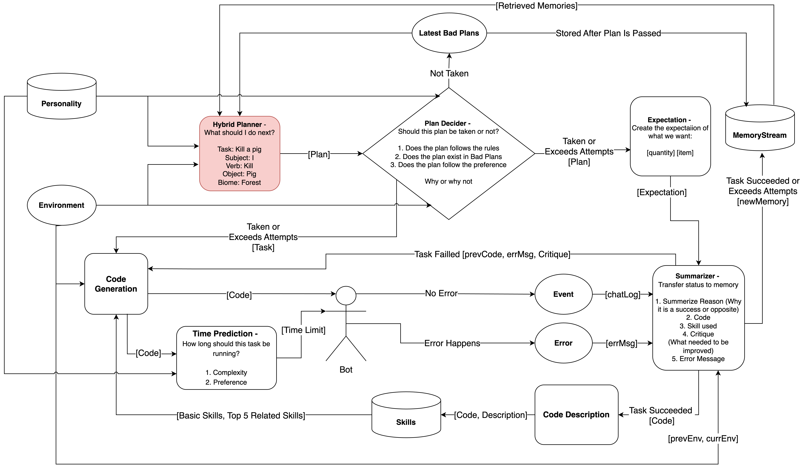
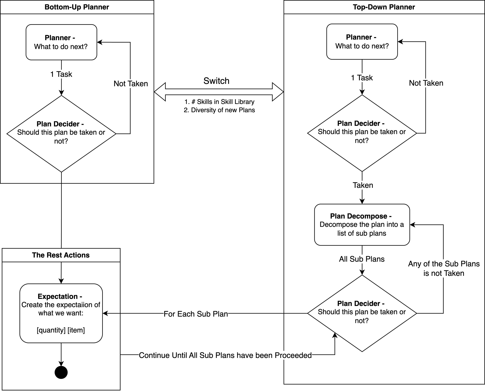

# MIMIC-Py

This repository is the Python version of MIMIC, a Large Language Model (LLM) based, 
personality-driven agent designed to test three different games, 
including [Dungeon Adventures](https://github.com/stelmaszczykadrian/Dungeon-Adventures), 
[Shattered Pixel Dungeon](https://shatteredpixel.com/), 
and [Minecraft](https://www.minecraft.net/en-us).

The MIMIC prototype implemented in JavaScript can be found [here](https://github.com/Mimic-Persona/MIMIC).

For more details about this project, please refer to our [HomePage](https://mimic-persona.github.io/MIMIC-Py-Home-Page/).

This project should be interpreted by [Python 3.12](https://www.python.org/downloads/release/python-3123/) (Python 3.12.3 tested).

# Prompts
Please find all the prompts used in the `prompts` directory. 
Each prompt is tailored to the specific game and personality traits of the agent:
- [Dungeon Adventure](./prompts/DA)
- [Shattered Pixel Dungeon](./prompts/SPD)
- [Minecraft](./prompts/MC)

# How to Run MIMIC-Py For the Supported Games

## Virtual Machine [Recommended for Demonstration Only]
1. If you just have a short demo on how it could run, we provide a virtual machine for you that equipped with all the dependencies and configurations done for you.
   - You can download the virtual machine from [here](https://drive.google.com/drive/folders/13YUvZ-rPbLjcrUvrajprqPhJnQdfbwKN?usp=sharing). 
   - You will need [VirtualBox](https://www.virtualbox.org/) to run the virtual machine.
   
2. After launch the VM, you will see a folder name `MIMIC-Python` on the desktop, which contains all you need for MIMIC-Py.

3. Right-click on `MIMIC-Python` and open it as PyCharm Project.

   4. Then you can continue with the README instructions from the `Configure the Settings` section.

## Environment Setup
1. MIMIC-Py requires Python 3.12. After cloning this repository, install the required dependencies by running:
   ```bash
   pip install -r requirements.txt
   ```
   
[//]: # (## Run ChromaDB in Docker)

[//]: # ()
[//]: # (chroma run --host localhost --port 8000 --path ./my_chroma_data)

[//]: # ()
[//]: # ()
[//]: # (1. Install [Docker Desktop]&#40;https://www.docker.com/products/docker-desktop/&#41; on your machine.)

[//]: # ()
[//]: # (2. Launch Docker Desktop and ensure it is running.)

[//]: # ()
[//]: # (3. Pull the ChromaDB Docker image:)

[//]: # ()
[//]: # (    ```bash)

[//]: # (    docker pull chromadb/chroma:latest)

[//]: # (    ```)

[//]: # ()
[//]: # (4. Run the ChromaDB Docker container with the following command:)

[//]: # ()
[//]: # (    ```bash)

[//]: # (    docker run -d -p 8000:8000 --name chromadb chromadb/chroma)

[//]: # (    ```)

[//]: # ()
[//]: # (5. Make sure the ChromaDB server is running by checking the logs in Docker Desktop.)

[//]: # ()
[//]: # (Once the container is running, MIMIC-Py can connect to ChromaDB through the default endpoint [http://localhost:8000]&#40;http://localhost:8000&#41; without additional configuration.)

## Configure the Settings
1. Taking `.emv.keep.this` file located in the `root` directory as an example to create the `.env` file located in the same place.
Find it [here](../.env.keep.this).

2. Set the `GAME_SUBJECT` as to the target game environment. The pre-defined options are MC, SPD, and DA, corresponding to the
three games we currently support: Minecraft, Shattered Pixel Dungeon, and Dungeon Adventures.

3. Set the `PERSONALITY` to the desired personality of MIMIC-Py. You can choose from the following options:
   - achievement
   - adrenaline
   - aggression
   - caution
   - completion
   - curiosity
   - efficiency

4. Set the `EXP_DURATION` to the desired time limit (in minutes) for MIMIC-Py to run in the game. 
The default is 125 minutes.

5. Set `IS_CONTINUED` to control whether the agent resumes from a previous testing session.
   - If set to `true`, MIMIC-Py loads the Memories and Skills associated with the specified `AGENT_NAME` and continues execution.  
   - If set to `false`, MIMIC-Py will start a fresh session and **DELETES** any existing data associated with the same `AGENT_NAME`.
   - We recommend setting this option to `true`, even for first-time runs.

6. Set the `OPENAI_API_KEY` to your OpenAI API key since we are using OPENAI's embedding model to generate embeddings for Memories and Skills.
     - You can obtain from the [OpenAI website](https://platform.openai.com/settings/organization/api-keys).
     - Make sure to keep your API key secure and do not share it publicly.
     - This key is required for MIMIC-Py to interact with the OpenAI API and generate responses.
     - This key should look like `sk-XXX...` or `sk-proj-XXX...`

7. Set the `INSTRUCTION_MODEL_NAME`, `INSTRUCTION_MODEL_URL`, `INSTRUCTION_MODEL_PATH`, and `INSTRUCTION_MODEL_PROVIDER` 
according to the model you are using.
   1. Using OpenAI's GPT models:
      1. For example, if you are using OpenAI's GPT-4o, you can set:
        ```
        INSTRUCTION_MODEL_NAME=openai/gpt-4o
        INSTRUCTION_MODEL_URL=
        INSTRUCTION_MODEL_PATH=
        INSTRUCTION_MODEL_PROVIDER=
        ```
        
   2. Using Ollama's models:
      1. Run the model you want on [Ollama](https://ollama.com/)
      2. Expose the Ollama to the network in Settings. The default URL is `http://localhost:11434`.
      3. For example, if you are using Ollama's Model XXX:Xb, you can set:
          ```
          INSTRUCTION_MODEL_NAME=ollama_chat/XXX:Xb
          INSTRUCTION_MODEL_URL=http://localhost:11434
          INSTRUCTION_MODEL_PATH=
          INSTRUCTION_MODEL_PROVIDER=
          ```

   3. Using local models:
      1. Implement your custom model class that extends the `CustomDspyLlmModel` class [here](../llm/custom_dspy_models/CustomDspyLlmModel.py).
      2. Please take `MineMaModel.py` as an example. You can find it [here](../llm/custom_dspy_models/MineMaModel.py).
      This example use the [MineMA/MineMA-3-8B-v4](https://huggingface.co/Aiwensile2/MineMA-8B/tree/main/MineMA-3-8b-v4) from ODYSSEY.
      3. For example, if you are using MineMaModel, you can set:
          ```
          INSTRUCTION_MODEL_NAME=MineMA/MineMA-3-8B-v4
          INSTRUCTION_MODEL_URL=
          INSTRUCTION_MODEL_PATH=./path/to/your/MineMA-3-8B-v4
          INSTRUCTION_MODEL_PROVIDER=
          ```

8. Set the `CODE_MODEL_NAME`, `CODE_MODEL_URL`, `CODE_MODEL_PATH`, and `CODE_MODEL_PROVIDER` according to the model you are using.
    - You can follow the same instructions as 6.

# Run MIMIC-Py for the Supported Games
1. Till now, all the configurations are done for MIMIC-Py. But to run it for a specific game, you still need to configure the game-specific settings.
   Please find the game-specific configuration instructions in the corresponding README files:
   - [Dungeon Adventures](./MIMIC_Dungeon_Adventures/README.md)
   - [Shattered Pixel Dungeon](./MIMIC_Shattered_Pixel_Dungeon/README.md)
   - [Minecraft](./MIMIC_Minecraft/README.md)

# How to Deploy MIMIC-Py into A New Game
## Represent the Game State
1. You need to define the game state representation for the new game. 
This should be a snapshot of all the relevant information about the current state of the game that the agent needs to make decisions.
   - This can include the player's position, health, inventory, environment details, etc.

2. After defining the game state representation, you need to implement the code to extract this information from the game environment.

## Update the Prompts:
1. Substitute the `Game State Representation` placeholders in all the existing prompts with the new game state representation defined in the previous step.
   1. From the template folder, you can find all the prompts used in MIMIC-Py.
   2. Please create a new folder for the new game and copy all the prompts from the template folder to the new folder.
   3. Update the game state representation in all the copied prompts.

2. Update any game-specific instructions in `bottomUp_plan_prompt_RP.txt` and `topDown_plan_prompt_RP.txt` to align with the mechanics and objectives of the new game.
   1. Substitute the `Task_Name` placeholder with the actual task you want the agent to perform in the new game.
   2. Substitute the `Task_Description` placeholder with the actual description of the task you want the agent to perform in the new game.

3. Substitute the `Game Rules / Output Formatting / Task Selection Criteria / Other Instructions` placeholders in `bottomUp_plan_prompt_RP.txt`, `topDown_plan_prompt_RP.txt`, and `plan_decompose_prompt.txt` with the specific rules, output formatting requirements, task selection criteria, or any other instructions relevant to the new game.

4. Update any of the output formatting for any of the component by:
   1. Updating the formatting instructions in the prompts.
   2. Updating the output [DSPy signatures](https://dspy.ai/learn/programming/signatures/) defined at [**line 111–136** of BotComponent.py](./bot_components/BotComponent.py).

5. Substitute all `XXX` placeholders in the prompts with the actual output examples relevant to the new game.

6. Modify the personalities in the prompts if necessary to better fit the context of the new game, can be found at [./prompts/template/personalities](./prompts/template/personalities).

7. If you find any problems during making out the new prompts, take the existing prompts for the three supported games as references.


## Game Interaction APIs

MIMIC-Py interacts with game environments through a lightweight socket-based bridge implemented in [./utils/Bridge.py](./utils/Bridge.py).  
By default, the bridge communicates with the game environment over a socket listening on `localhost:1111` (can be reconfigured in the `.env` file).

### Available APIs

The following four APIs are provided for environment interaction:

1. **`get_command()`**  
   Blocks until a socket message with `msgType="command"` is received, then returns the command string.

2. **`get_status()`**  
   Sends a socket message with `msgType="GetStatus"` and waits for a response with `msgType="status"`.  
   **Returns** a serialized representation of the current game state.

3. **`act_and_feedback(plan)`**  
   Sends an action plan to the game environment using a socket message prefixed with `"ACTION:"`, where `plan` is serialized as JSON transferred from the Planner output directly. 
Blocks until a response with `msgType="feedback"` is received, which is expected to contain:
   - "logs": A string of log messages generated during action execution.
   - "errors": A string of error messages encountered during action execution.  
   **Returns** a list of two feedback objects storing logs and errors separately.

4. **`run_and_feedback(code, programs, timeout, executor)`**  
   Executes generated code directly inside the game environment, using `programs` as helper functions and enforcing a time limit (`timeout`). If the `GAME_SUBJECT` is not `MC`, the `executor` should be a function that executes the code and returns Tuple(a string as the game state representation, a dictionary of `is_timeout`, `bot_msg`, `err_msg`).  
   - `is_timeout`: Boolean, flag if the execution is failed due to time-out, 
   - `bot_msg`: all the log messages during execution, 
   - `err_msg`: all the error messages during execution.  
   **Returns** observations and execution metadata after completion.

### Invocation Semantics

- **`get_command()`**  
  Invoked once at startup. MIMIC-Py blocks on this call until the game environment sends a start signal, **"b"**.

- **`get_status()`**  
  Invoked at the beginning of each interaction loop and after each action execution to retrieve the current game state.

- **`act_and_feedback(plan)`**  
  Used **only** when the *Plan-to-Parameters* interaction mechanism is enabled.  
  Action plans are transmitted as structured JSON and expected to be executed by the game environment.

- **`run_and_feedback(code, programs, timeout, executor)`**  
  Used **only** when the *Plan-to-Code* interaction mechanism is enabled.  
  This mode currently supports **Minecraft only**.

### Interaction Mechanisms

MIMIC-Py supports two mutually exclusive interaction modes:

1. **Plan-to-Parameters**  
   - The agent generates structured action plans (JSON).
   - Plans are sent to the game environment endpoints waiting to be executed via `act_and_feedback(plan)`.

2. **Plan-to-Code**  
   - The agent generates executable code snippets.  
   - Code is expected to be executed inside the game environment via `run_and_feedback(code, programs, timeout, executor)` with the function inputted as the `executor`, this can be configured at `run.py` file. Meaning that to make this work, you have to implement one executor function yourself. 
     - An example implementation for Minecraft can be found in  [./MIMIC_Minecraft/mc_env/MineEnv.py](./MIMIC_Minecraft/mc_env/MineEnv.py) as function `step()`.
   - In addition, you must provide example usages of the APIs exposed by the target game environment. These examples should be specified using both code and accompanying textual descriptions.
     - The examples should be placed under the directory `./skill_system/skill_library/<GAME_SUBJECT>/basic_skills/`.
     - These initial examples serve as *Basic Skills* and are used to bootstrap interaction and guide subsequent Skill generation.
     - Existing basic Skills for Minecraft can be used as references: [./skill_system/skill_library/MC/basic_skills](./skill_system/skill_library/MC/basic_skills).

### Notes for Deploying to New Games

- When adding support for a new game environment, developers must implement the appropriate game-side socket handlers and map them to the APIs defined in `Bridge.py`.

- Register the new environment by setting `GAME_SUBJECT` to the corresponding identifier and configuring the `IS_PLAN_TO_CODE` flag in the `.env` file to select the appropriate interaction mode.

- If the new game is intended to support **Plan-to-Code**, additional integration is required:
  - Implement a game-specific execution environment (similar to `MineEnv.py`) to run generated code.

These steps localize game-specific engineering effort while allowing the core planning, memory, and summarization components of MIMIC-Py to remain unchanged.


# Acknowledgements
[MIMIC-Persona](https://github.com/Mimic-Persona): Doing everything for this project.

ChatGPT: As the only artist in this group making the Logo.

# Overview of MIMIC



# Design of MIMIC

## Abstract Workflow


## Detailed Workflows


## Hybrid Planner Architecture


[//]: # (## Memory System Architecture)

[//]: # ()
[//]: # (![Memory System Architecture]&#40;./images/MIMIC_Memory_System_Workflow.png&#41;)
